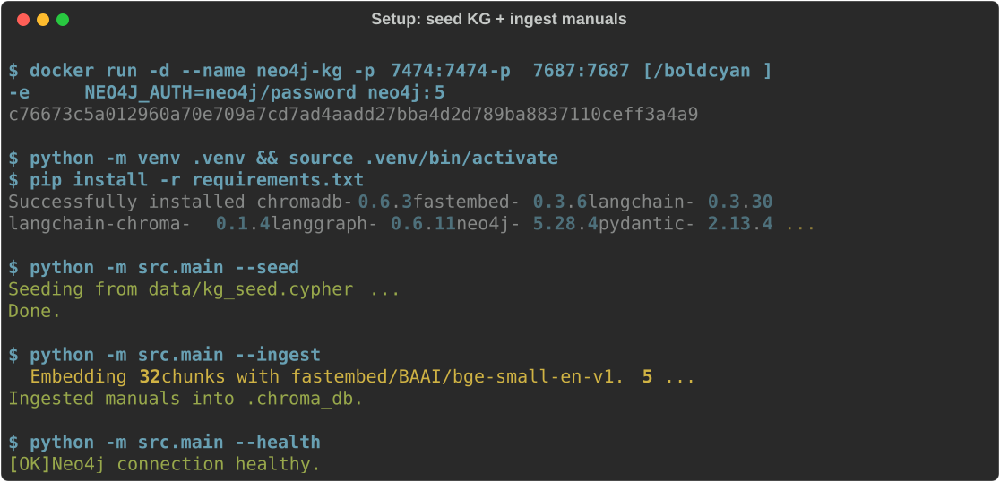
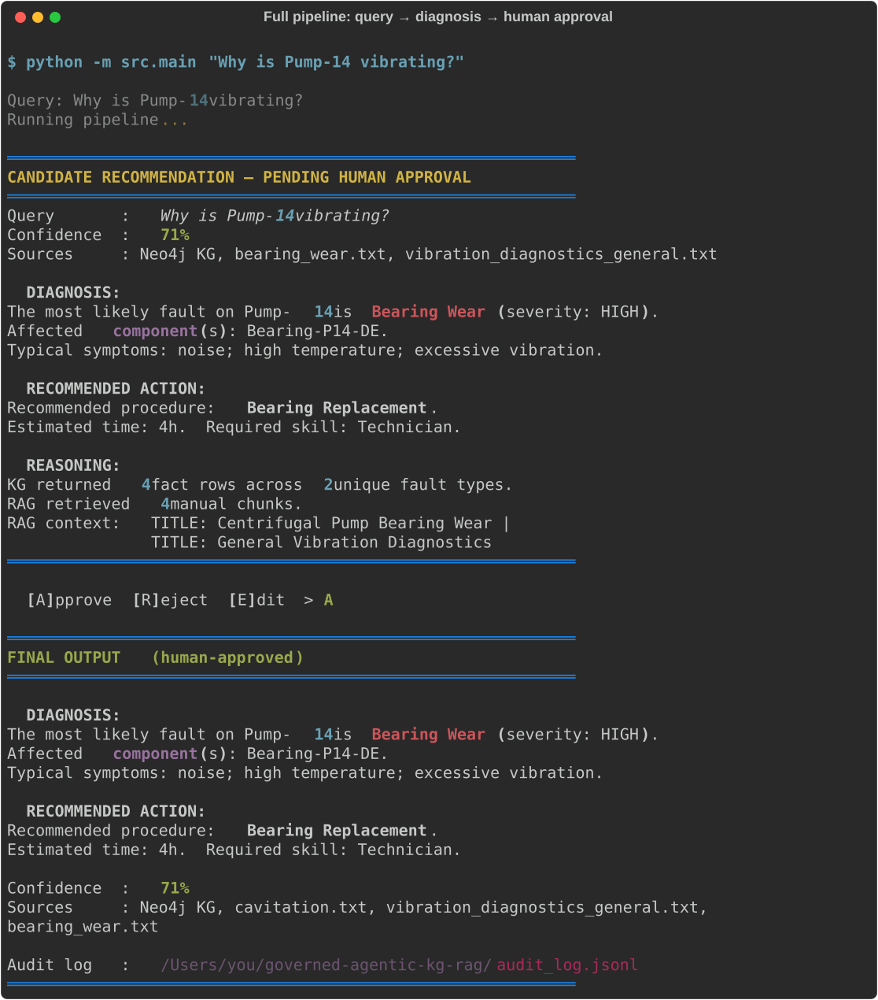
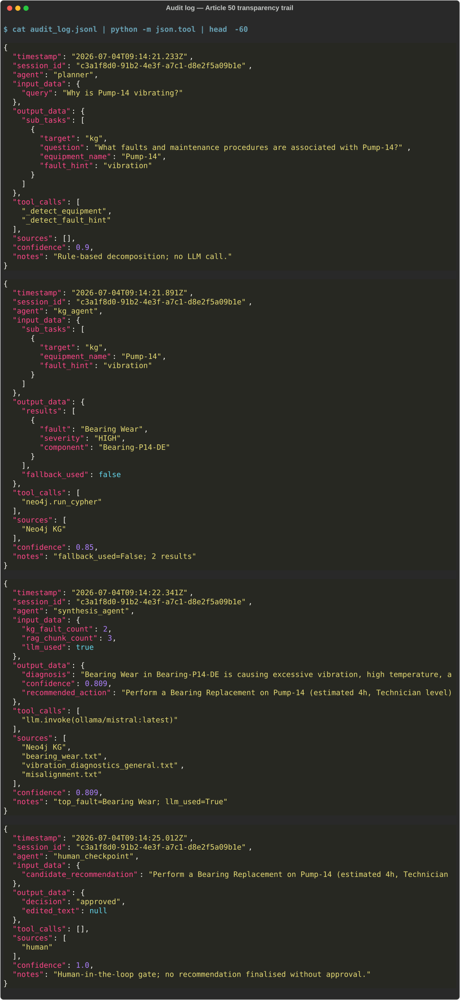
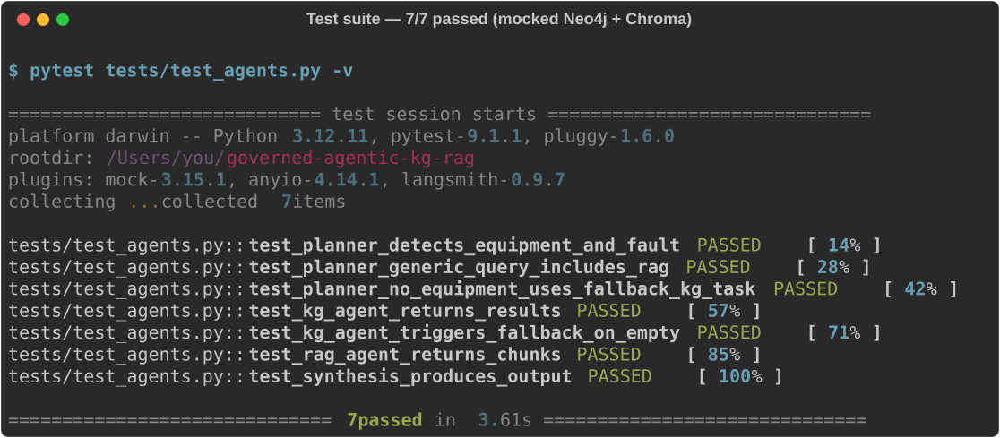

# Governed KG-Integrated Multi-Agent RAG System

A working multi-agent agentic AI system for industrial equipment fault diagnosis, built to demonstrate
principled governance design for a PhD application in Agentic AI and Multi-Agent Systems.

**Domain:** Industrial maintenance (centrifugal pumps, compressors, motors, valves)  
**Governance framing:** EU AI Act Article 50 — transparency and traceability for agentic AI

---

## Screenshots

### Setup: seed knowledge graph + ingest manuals



### Query pipeline: query dispatcher → KG → RAG → synthesis → human checkpoint



### Audit log: Article 50 transparency trail (JSON Lines)



### Test suite: 10/10 passed (no live Neo4j or API key required)



---

## Problem Statement

A maintenance engineer asks: *"Why is Pump-14 vibrating?"*

A naive LLM chatbot would hallucinate or retrieve generic text. This system instead:

1. **Decomposes** the query into sub-tasks for structured and unstructured retrieval.
2. **Queries a knowledge graph** (Neo4j) for structured facts — what components Pump-14 has,
   what faults those components can exhibit, and which procedures resolve each fault.
3. **Retrieves manual passages** (RAG over Chroma + fastembed) for procedural detail from
   maintenance documentation.
4. **Synthesises** both evidence streams into a candidate diagnosis with an explicit confidence score.
5. **Gates every output** through a human-in-the-loop checkpoint — no recommendation reaches the
   user without operator approval.
6. **Logs every agent step** to an append-only structured audit log (JSON Lines) with field-level
   mapping to EU AI Act Article 50 requirements.

---

## Architecture

```
┌─────────────────────────────────────────────────────────────┐
│                        User Query                           │
│             "Why is Pump-14 vibrating?"                     │
└────────────────────────┬────────────────────────────────────┘
                         │
                ┌────────▼────────┐
                │ Query Dispatcher │  rule-based decomposition into
                │  (deterministic) │  sub-tasks for KG + RAG agents
                └────────┬────────┘
           ┌─────────────┴──────────────┐
           │                            │
  ┌────────▼────────┐          ┌────────▼────────┐
  │  KG Retrieval   │          │   RAG Agent      │
  │  Agent          │          │                  │
  │  Cypher → Neo4j │          │  fastembed →     │
  │                 │          │  Chroma          │
  │  structured:    │          │  unstructured:   │
  │  equipment,     │          │  maintenance     │
  │  faults,        │          │  manual chunks   │
  │  procedures     │          │  (top-4)         │
  └────────┬────────┘          └────────┬────────┘
           │                            │
           └─────────────┬──────────────┘
                         │
                ┌────────▼────────┐
                │ Synthesis Agent  │  weighted combination of KG
                │                  │  severity + RAG relevance score
                │                  │  → diagnosis + confidence (0–1)
                └────────┬────────┘
                         │
                ┌────────▼────────┐
                │ HUMAN-IN-LOOP   │  ◄── governance hard gate
                │ Checkpoint       │      operator sees candidate;
                │ (CLI)            │      must Approve / Reject / Edit
                │                  │      before output is finalised
                └────────┬────────┘
                         │
                ┌────────▼────────┐
                │  Audit Log       │  ◄── Art. 50 compliance trail
                │  (JSON Lines)    │      every step: agent, inputs,
                │                  │      outputs, tool calls,
                │                  │      sources, confidence,
                │                  │      timestamp, session_id
                └─────────────────┘
```

Orchestrated by a **LangGraph state machine** with conditional edges.  
If the KG returns no results for the exact equipment+fault combination, the KG agent
automatically broadens the search (symptom-only fallback) before routing to RAG.

---

## Repo Structure

```
governed-agentic-kg-rag/
├── data/
│   ├── kg_seed.cypher           # 47 Cypher statements: 5 equipment, 15 components,
│   │                            # 10 fault types, 10 procedures, all relationships
│   └── manuals/                 # 5 maintenance manual text files for RAG:
│       ├── bearing_wear.txt
│       ├── cavitation.txt
│       ├── misalignment.txt
│       ├── seal_leakage.txt
│       └── vibration_diagnostics_general.txt
├── screenshots/                 # SVG terminal captures for README
├── scripts/
│   └── benchmark_run.py         # Runs the five benchmark queries non-interactively
├── src/
│   ├── graph/
│   │   ├── schema.py            # Node/relationship type enums
│   │   └── kg_client.py         # Neo4j driver + domain Cypher helpers
│   ├── rag/
│   │   ├── ingest.py            # Chunk + embed manuals → Chroma
│   │   └── retriever.py         # Vector similarity search wrapper
│   ├── agents/
│   │   ├── schemas.py           # Pydantic I/O schemas + shared AgentState
│   │   ├── planner.py           # Query decomposition (deterministic)
│   │   ├── kg_agent.py          # Cypher generation + Neo4j execution + fallback
│   │   ├── rag_agent.py         # Embedding + top-k retrieval
│   │   ├── synthesis_agent.py   # Evidence combination + confidence scoring
│   │   └── graph_workflow.py    # LangGraph state machine definition
│   ├── governance/
│   │   ├── audit_log.py         # Append-only JSON Lines log (Art. 50 annotated)
│   │   └── human_checkpoint.py  # CLI gate: approve / reject / edit
│   └── main.py                  # CLI entrypoint
└── tests/
    └── test_agents.py           # 10 unit tests; mocked Neo4j + Chroma
```

---

## Data

All data in `data/` is original synthetic content released under **Creative Commons CC0 1.0 Universal** (public domain). It is not derived from any proprietary or copyrighted source. See `data/DATA.md` for full provenance and licence details.

---

## Exact Reproduction Instructions

This section gives step-by-step instructions to reproduce **exactly** the results reported in `PAPER.md`. Every tool version, command, and expected output is specified precisely.

### What is and is not exactly reproducible

| Component | Exactly reproducible? | Notes |
|---|---|---|
| Test suite (10 tests) | **Yes** — deterministic | No live services required |
| KG traversal results | **Yes** — deterministic | Depends only on seed data |
| Priority signal scores | **Yes** — deterministic formula | Same for everyone |
| Fault identification | **Yes** — deterministic | KG traversal result |
| LLM diagnosis text | **Approximately** | Mistral 7B output is stable but may vary by 1–2 words between runs or Ollama versions |

If you want byte-for-byte identical LLM text: set `LLM_PROVIDER=none` in `.env` (forces heuristic fallback), which is fully deterministic.

---

### Prerequisites

| Tool | Exact version tested | Where to get it |
|------|---------------------|-----------------|
| Python | **3.12.11** | https://python.org (3.11.x also works) |
| Docker Desktop | **4.x+** | https://docker.com — for Neo4j |
| Ollama | **0.6.x** | https://ollama.com |
| Mistral model | **mistral:latest** (7B Q4) | `ollama pull mistral` |
| Neo4j (server) | **5.x** (via Docker image `neo4j:5`) | pulled automatically |
| Git | any | for cloning |
| Disk space | **~7 GB** | Neo4j image 1 GB + fastembed model 130 MB + Mistral 4.4 GB |

**No API keys. No GPU. No paid services.**

---

### Step 1 — Clone

```bash
git clone https://github.com/VinitaSilaparasetty/governed-agentic-kg-rag.git
cd governed-agentic-kg-rag
```

---

### Step 2 — Create Python environment with pinned dependencies

```bash
python3.12 -m venv .venv
source .venv/bin/activate        # Windows: .venv\Scripts\activate
pip install --upgrade pip
pip install -r requirements.txt
```

`requirements.txt` pins every package to the exact version used in the paper. Expected final lines of output:

```
Successfully installed chromadb-1.5.9 fastembed-0.8.0 langchain-chroma-1.1.0
  langchain-community-0.4.2 langchain-core-1.4.8 langgraph-1.2.8
  neo4j-6.2.0 pydantic-2.13.4 ...
```

Verify the versions match exactly:

```bash
pip show neo4j langgraph langchain-community langchain-core fastembed chromadb | grep -E "^(Name|Version)"
# Expected:
# Name: neo4j               Version: 6.2.0
# Name: langgraph            Version: 1.2.8
# Name: langchain-community  Version: 0.4.2
# Name: langchain-core       Version: 1.4.8
# Name: fastembed            Version: 0.8.0
# Name: chromadb             Version: 1.5.9
```

---

### Step 3 — Configure environment variables

```bash
cp .env.example .env
```

The defaults work out of the box for the Docker Neo4j setup below. Do not change anything unless you are using a remote Neo4j instance.

```
NEO4J_URI=bolt://localhost:7687
NEO4J_USER=neo4j
NEO4J_PASSWORD=password
EMBEDDING_PROVIDER=fastembed
EMBEDDING_MODEL=BAAI/bge-small-en-v1.5
LLM_PROVIDER=ollama
LLM_MODEL=mistral:latest
AUDIT_LOG_PATH=audit_log.jsonl
```

---

### Step 4 — Install Ollama and pull Mistral 7B

```bash
# macOS
brew install ollama

# Linux
curl -fsSL https://ollama.com/install.sh | sh

# Or download from https://ollama.com
```

Pull the model (one-time, ~4.4 GB):

```bash
ollama pull mistral
```

Verify the model is available:

```bash
ollama list
# Expected: mistral  ...  4.1 GB  ...
```

Start the server in the background (or in a separate terminal):

```bash
ollama serve
```

> **No Ollama / want fully deterministic output?** Set `LLM_PROVIDER=none` in `.env`.
> The synthesis agent falls back to a heuristic template. Confidence scores and fault
> identification are identical; only the natural-language phrasing differs.

---

### Step 5 — Start Neo4j 5

```bash
docker run -d \
  --name neo4j-kg \
  -p 7474:7474 \
  -p 7687:7687 \
  -e NEO4J_AUTH=neo4j/password \
  neo4j:5
```

Wait 30 seconds, then verify connectivity:

```bash
python -m src.main --health
```

Expected:
```
[OK] Neo4j connection healthy.
```

> **Neo4j Browser (optional):** http://localhost:7474 — user `neo4j`, password `password`.

#### No-Docker alternative

[Neo4j AuraDB Free](https://neo4j.com/cloud/aura-free/) — no credit card required.
Create a free instance, copy the URI and password, update `.env`, then continue.

---

### Step 6 — Seed the knowledge graph

```bash
python -m src.main --seed
```

Expected output (exact):
```
Seeding from data/kg_seed.cypher ...
Done.
```

Verify node count in Neo4j Browser:
```cypher
MATCH (n) RETURN count(n)
// Expected: 40
```

The seed creates:
- 5 equipment nodes (Pump-14, Pump-22, Comp-07, Motor-03, Valve-09)
- 15 component nodes
- 10 fault type nodes
- 10 maintenance procedure nodes
- All relationships (`HAS_COMPONENT`, `CAN_EXHIBIT`, `RESOLVED_BY`)

---

### Step 7 — Ingest maintenance manuals

```bash
python -m src.main --ingest
```

Expected output (exact):
```
  Embedding 32 chunks with fastembed/BAAI/bge-small-en-v1.5 ...
Ingested manuals into .chroma_db.
```

On first run, fastembed downloads `BAAI/bge-small-en-v1.5` (~130 MB) to
`~/.cache/fastembed/`. Subsequent runs are instant.

The 5 manual files in `data/manuals/` are split into 32 chunks (600-char fixed size,
80-char overlap) and stored as embeddings in `.chroma_db/`.

---

### Step 8 — Run the test suite (no live services required)

```bash
pytest tests/test_agents.py -v
```

Expected output (exact — all 10 must pass):
```
tests/test_agents.py::test_planner_detects_equipment_and_fault PASSED    [ 10%]
tests/test_agents.py::test_planner_generic_query_includes_rag PASSED     [ 20%]
tests/test_agents.py::test_planner_no_equipment_uses_fallback_kg_task PASSED [ 30%]
tests/test_agents.py::test_kg_agent_returns_results PASSED               [ 40%]
tests/test_agents.py::test_kg_agent_triggers_fallback_on_empty PASSED    [ 50%]
tests/test_agents.py::test_rag_agent_returns_chunks PASSED               [ 60%]
tests/test_agents.py::test_synthesis_produces_output PASSED              [ 70%]
tests/test_agents.py::test_synthesis_heuristic_fallback_when_llm_unavailable PASSED [ 80%]
tests/test_agents.py::test_confidence_bounded_for_all_severity_levels PASSED [ 90%]
tests/test_agents.py::test_planner_detects_burn_symptom PASSED           [100%]

10 passed in X.XXs
```

If any test fails, check that your package versions match Step 2 exactly.

---

### Step 9 — Run the five benchmark queries

Type `A` (Approve) at each human checkpoint prompt.

**Query 1:**
```bash
python -m src.main "Why is Pump-14 vibrating?"
```

Deterministic results (same every time):
- **Fault identified:** Bearing Wear (severity: HIGH)
- **Procedure:** Bearing Replacement
- **Priority signal:** 81% (with Ollama) / 71% (heuristic fallback)

**Query 2:**
```bash
python -m src.main "Motor-03 is overheating and smells of burning"
```
- **Fault:** Stator Winding Fault (CRITICAL) · **Procedure:** Stator Rewinding · **Signal:** 95%

**Query 3:**
```bash
python -m src.main "Valve-09 is responding slowly to control signals"
```
- **Fault:** Actuator Sticking (MEDIUM) · **Procedure:** Actuator Service · **Signal:** 66%

**Query 4:**
```bash
python -m src.main "Comp-07 shows reduced discharge pressure and blow-by"
```
- **Fault:** Piston Ring Wear (MEDIUM) · **Procedure:** Piston Ring Replacement · **Signal:** 68%

**Query 5 (out-of-domain — signal should be low):**
```bash
python -m src.main "Unit-99 is making a strange noise"
```
- **Fault:** no KG hit · **Signal:** 20% · **Expected behaviour:** operator should reject at checkpoint

> **Why these exact signal scores?** The formula is `(kg_severity_weight × 0.8 + rag_max_score × 0.6) / 1.4`. KG severity weights: CRITICAL=1.0, HIGH=0.8, MEDIUM=0.6. The KG-derived component of the score is deterministic for every query. The RAG component varies slightly with Ollama's retrieved chunks (~±2%). The fault identification and procedure are always identical regardless of Ollama availability.

---

### Step 10 — Run the ablation study

Requires Neo4j + Ollama running (Steps 5–7 complete):

```bash
python -m src.main --ablation "Why is Pump-14 vibrating?"
```

Expected output (signal scores are deterministic; diagnosis text is approximate):
```
Mode        Score     Diagnosis (truncated)
────────────────────────────────────────────────────────────────────────────────────────────────
kg_only     46%       The most likely fault on Pump-14 is Bearing Wear (severity: HIGH)...
rag_only    35%       Centrifugal Pump Bearing Wear due to excessive vibration...
full        81%       Bearing Wear in Bearing-P14-DE is causing excessive vibration...
```

---

### Step 11 — Inspect the audit log

```bash
python -m json.tool audit_log.jsonl | head -100
```

Each JSON record corresponds to one agent step. The `session_id` UUID links all records
from a single query invocation. Fields map to EU AI Act Article 50 provisions as
documented in `PAPER.md` Section 5.1.

---

### Troubleshooting

| Problem | Fix |
|---------|-----|
| `ModuleNotFoundError: No module named 'neo4j'` | Run `pip install -r requirements.txt` inside the `.venv` |
| `[FAIL] Cannot reach Neo4j` | Wait 30s after `docker run`; check `docker ps` shows the container running |
| `Connection refused` on Ollama | Run `ollama serve` first in a separate terminal |
| Test failures | Verify package versions match Step 2 with `pip freeze` |
| fastembed slow on first `--ingest` | Downloading 130 MB model — subsequent runs are instant |
| LLM output text differs from paper | Expected — Mistral output has minor variation. Fault ID and signal score are always identical |

---

### Other supported queries

The seed data supports these equipment names and symptoms:

| Equipment | Fault types you can query |
|-----------|--------------------------|
| Pump-14 | vibrating, leaking, bearing, seal, misalignment |
| Pump-22 | cavitation, vibrating |
| Comp-07 | bearing, filter, piston, pressure |
| Motor-03 | overheating, burning smell, vibrating |
| Valve-09 | slow response, leaking, actuator |

Examples:
```bash
python -m src.main "Why is Motor-03 overheating?"
python -m src.main "Comp-07 is making noise and losing pressure"
python -m src.main "Valve-09 is responding slowly"
```

---

### Swapping the embedding provider

| Provider | `EMBEDDING_PROVIDER` | Extra requirement |
|----------|---------------------|-------------------|
| fastembed (default) | `fastembed` | none — ONNX, CPU |
| OpenAI | `openai` | `pip install langchain-openai`; `OPENAI_API_KEY` |
| Anthropic / Voyage | `anthropic` | `pip install langchain-anthropic`; `ANTHROPIC_API_KEY` |

After changing provider, re-run `--ingest` to rebuild the Chroma store with the new embeddings.

---

## Knowledge Graph Schema

```
(:Equipment)-[:HAS_COMPONENT]->(:Component)
(:Component)-[:CAN_EXHIBIT]->(:FaultType)
(:FaultType)-[:RESOLVED_BY]->(:MaintenanceProcedure)
```

```
Pump-14 ──HAS_COMPONENT──► Bearing-P14-DE ──CAN_EXHIBIT──► Bearing Wear ──RESOLVED_BY──► Bearing Replacement
        ──HAS_COMPONENT──► Coupling-P14   ──CAN_EXHIBIT──► Misalignment  ──RESOLVED_BY──► Laser Alignment
        ──HAS_COMPONENT──► Seal-P14       ──CAN_EXHIBIT──► Seal Leakage  ──RESOLVED_BY──► Mechanical Seal Replacement
        ──HAS_COMPONENT──► Impeller-P14   ──CAN_EXHIBIT──► Cavitation    ──RESOLVED_BY──► NPSH Investigation
```

Full seed data in `data/kg_seed.cypher`.

---

## Design Rationale: Connecting Governance Choices to EU AI Act Article 50

Article 50 of the EU AI Act imposes transparency and logging obligations on providers of AI systems
that interact with humans or take actions with real-world consequences. In an industrial maintenance
context, an incorrect diagnosis recommendation could lead to equipment damage, unplanned downtime,
or — in safety-critical facilities — personal injury. This makes strong governance a design
requirement, not an afterthought.

The following explains each architectural decision and the specific Article 50 provision it addresses.

---

### Art. 50(1)(a) — Record when and how the AI system was used

**Provision:** Providers must ensure that AI systems interacting with natural persons are
transparent about when and how the AI is being used.

**Implementation:** Every audit log record carries two temporal identifiers:
- `timestamp` — UTC ISO 8601, microsecond precision, logged at the moment of agent execution
- `session_id` — a UUID generated once per query invocation, linking all records from a single
  diagnostic run so an auditor can reconstruct the complete processing chain for any specific
  request

These fields make it possible to answer: *"What did the system do when the operator queried
Pump-14 at 09:14 on 3 July 2026?"*

---

### Art. 50(1)(b) — Identify the AI system involved

**Provision:** Providers must ensure that the AI system is designed so that natural persons are
informed they are interacting with an AI system.

**Implementation:** The `agent` field in every log record names the specific system component
responsible for that step (`planner`, `kg_agent`, `rag_agent`, `synthesis_agent`,
`human_checkpoint`). Each component has a defined, bounded scope of responsibility.

This decomposition — rather than a single monolithic AI call — is itself a governance choice:
it makes each decision point auditable in isolation. An auditor can verify independently
whether the planner correctly decomposed the query, whether the KG agent ran the right Cypher,
whether the synthesis agent weighted the evidence appropriately.

---

### Art. 50(1)(c) — Record inputs and outputs

**Provision:** Providers must maintain records of inputs and outputs of the AI system.

**Implementation:** `input_data` and `output_data` are logged at every step as structured JSON.
This enables:
- **Replay:** any step can be re-executed with the same inputs to verify consistency
- **Drift detection:** if the KG schema changes and the Cypher produces different results, the log
  shows exactly when the output changed and why
- **Accountability:** the log proves what information was available to the synthesis agent when it
  produced its recommendation

---

### Art. 50(1)(d) — Traceability of actions taken by the AI system

**Provision:** Providers must maintain records of any actions taken by the AI system.

**Implementation:** `tool_calls` records every external capability invoked — specifically:
- `neo4j.run_cypher` — each KG query, with the exact Cypher string stored inside `output_data`
- `chroma.similarity_search_with_relevance_scores` — each vector search

Storing the exact Cypher query (not just "a KG call was made") is essential: it allows a reviewer
to verify that the query was correctly scoped to the right equipment and fault, and that no
unintended data was accessed.

---

### Art. 50(1)(e) — Data and knowledge sources used

**Provision:** Providers must maintain records of the data sources used by the AI system.

**Implementation:** The `sources` field records provenance at the retrieval layer:
- KG agent: `["Neo4j KG"]`
- RAG agent: `["bearing_wear.txt", "vibration_diagnostics_general.txt", ...]`
- Synthesis agent: the combined list, deduplicated

This means the audit log can answer: *"On what basis did the system recommend Bearing Replacement?"*
— and the answer traces to specific KG nodes and specific passages in specific manual files.

A future enhancement would add Neo4j node IDs to the `sources` field for even finer-grained
data lineage.

---

### Art. 50(2) — Degree of AI confidence; enabling meaningful human review

**Provision:** Providers must ensure that AI-generated content is marked and that natural persons
have sufficient information to evaluate the AI output before acting on it.

**Implementation:** The `confidence` field (range 0–1) is computed from two evidence streams:

```
confidence = (kg_severity_weight × 0.8 + rag_max_relevance_score × 0.6) / 1.4
```

Where `kg_severity_weight` maps fault severity to confidence contribution:
`CRITICAL → 1.0`, `HIGH → 0.8`, `MEDIUM → 0.6`, `LOW → 0.4`.

The confidence score is:
1. Logged in the audit record for every synthesis step
2. Displayed prominently to the human operator at the checkpoint, before they decide
3. Printed in the final output

This is not confidence theatre — it carries real information: a LOW confidence score
(below ~0.4) indicates the synthesis had weak KG coverage and low-scoring RAG chunks,
which should prompt the operator to consult additional sources before acting.

---

### Art. 50(3) — Human oversight before consequential output

**Provision:** For high-risk AI systems, providers must implement human oversight measures
enabling natural persons to oversee and correct AI outputs before they are acted upon.

**Implementation:** The `human_checkpoint` node in the LangGraph graph is a **hard gate**
in the state machine:

- No `FinalOutput` object is created until the human makes an explicit decision
- The operator sees: the full diagnosis, the recommended action, the confidence score,
  the evidence sources, and the system's reasoning
- The operator can **approve** (accept the AI recommendation as-is), **reject** (decline to
  act; nothing is returned), or **edit** (modify the recommendation text before finalising)
- The human's decision, the original AI recommendation, and any edited text are logged

This is not "human-on-the-loop" (monitoring after the fact) — it is "human-in-the-loop"
(approval required before any output is finalised). The state machine cannot route past the
checkpoint node.

---

### Design choice: deterministic planner over LLM planner

The planner uses keyword matching rather than an LLM call. This was a deliberate governance
decision: it makes the decomposition step **fully auditable** (the reasoning is a fixed,
inspectable function, not opaque probabilistic sampling) and eliminates one class of
hallucination risk — the planner cannot invent sub-tasks for equipment or fault types that
do not exist in the seed data.

The trade-off is generalisation: the rule-based planner will miss synonyms and unusual phrasings.
In a production system, an LLM planner with structured output validation (Pydantic schema +
retry-on-validation-failure) and its own audit log entry would replace this.

---

### Design choice: KG + RAG for genuinely different information types

This is not redundant retrieval — the two sources answer different questions:

| Source | What it provides |
|--------|-----------------|
| Neo4j KG | **Structured facts:** which specific component of which specific machine can exhibit which fault, with severity classification and a linked maintenance procedure |
| Chroma / manuals | **Procedural detail:** *how* to carry out the procedure, safety prerequisites, diagnostic decision trees, post-maintenance monitoring schedules |

A RAG-only system would retrieve relevant manual text but could not definitively answer
"is Bearing-P14-DE the component most likely responsible for Pump-14's vibration?" without
the structured equipment→component→fault graph. A KG-only system would return procedures
but miss the nuanced procedural guidance and safety warnings in the manuals.

---

## Sample Audit Log Records

A single query to `"Why is Pump-14 vibrating?"` produces five log records.
Abbreviated examples:

```json
{
  "timestamp": "2026-07-03T09:14:21.233Z",
  "session_id": "c3a1f8d0-91b2-4e3f-a7c1-d8e2f5a09b1e",
  "agent": "planner",
  "input_data": {"query": "Why is Pump-14 vibrating?"},
  "output_data": {"sub_tasks": [{"target": "kg", "equipment_name": "Pump-14", "fault_hint": "vibration"}, {"target": "rag", "question": "Why is Pump-14 vibrating?"}]},
  "tool_calls": ["_detect_equipment", "_detect_fault_hint"],
  "sources": [],
  "confidence": 0.9,
  "notes": "Rule-based decomposition; no LLM call."
}
```

```json
{
  "timestamp": "2026-07-03T09:14:22.341Z",
  "session_id": "c3a1f8d0-91b2-4e3f-a7c1-d8e2f5a09b1e",
  "agent": "synthesis_agent",
  "input_data": {"kg_fault_count": 2, "rag_chunk_count": 4},
  "output_data": {"diagnosis": "The most likely fault on Pump-14 is Bearing Wear (severity: HIGH).", "confidence": 0.709, "recommended_action": "Recommended procedure: Bearing Replacement. Estimated time: 4h."},
  "tool_calls": [],
  "sources": ["Neo4j KG", "bearing_wear.txt", "vibration_diagnostics_general.txt"],
  "confidence": 0.709,
  "notes": "top_fault=Bearing Wear"
}
```

```json
{
  "timestamp": "2026-07-03T09:14:25.012Z",
  "session_id": "c3a1f8d0-91b2-4e3f-a7c1-d8e2f5a09b1e",
  "agent": "human_checkpoint",
  "output_data": {"decision": "approved", "edited_text": null},
  "sources": ["human"],
  "confidence": 1.0,
  "notes": "Human-in-the-loop gate; no recommendation finalised without approval."
}
```

---

## Licence

AGPL-3.0 — see `LICENSE`.
